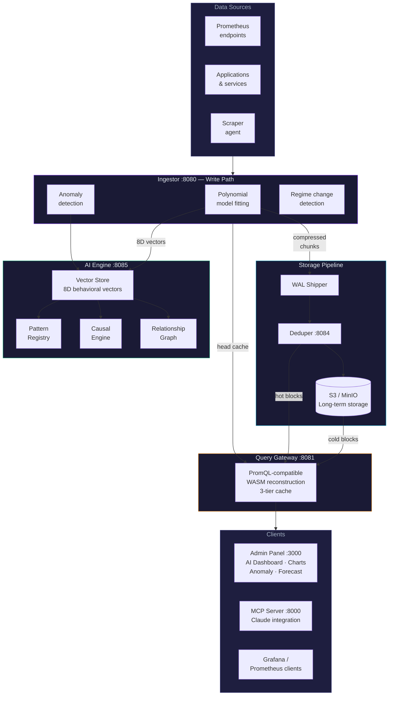

<div align="center">


# TSDB.ai

**AI-native time series database — built in Go**

[](./CHANGELOG.md)
[](https://golang.org)
[](https://nodejs.org)
[](https://react.dev)
[](./docs/license.md)
[](https://tsdb.ai)

**[Website](https://tsdb.ai) · [Documentation](https://tsdb.ai/docs) · [Pro Features](https://tsdb.ai/pro) · [Local Docs](./docs/)**

</div>

---

TSDB.ai compresses your Prometheus metrics using polynomial model fitting — storing the *shape* of each metric rather than every raw sample. The result is up to 98% smaller storage footprint, and because every metric is represented as an 8-dimensional behavioral vector, the database can do things no traditional TSDB can: detect anomalies, identify patterns, forecast futures, and trace causal chains — automatically, with zero configuration.

## Storage Comparison

### Compression method

| | Prometheus | VictoriaMetrics | **TSDB.ai** |
|---|:---:|:---:|:---:|
| Algorithm | Delta/XOR (Gorilla) | Variable-length int | **Polynomial model fitting** |
| Bytes per sample | ~1.5 B | ~0.6 B | **~0.3 B** |
| Compression ratio | 10.67× | 26.67× | **53.33×** |
| Storage efficiency | 90.6% | 96.25% | **98.13%** |

### Real-world storage at scale

> Assumes 15-second scrape interval. Raw sample cost = 16 bytes (8B timestamp + 8B float64).

| Scale | Timespan | Prometheus | VictoriaMetrics | **TSDB.ai** | **TSDB.ai saves vs Prometheus** |
|---|---|---:|---:|---:|---:|
| 1,000 metrics | 1 day | 259 MB | 104 MB | **52 MB** | **80% less** |
| 1,000 metrics | 30 days | 7.8 GB | 3.1 GB | **1.6 GB** | **80% less** |
| 10,000 metrics | 30 days | 78 GB | 31 GB | **15.5 GB** | **80% less** |
| 10,000 metrics | 1 year | 945 GB | 378 GB | **189 GB** | **80% less** |
| 100,000 metrics | 1 year | 9.45 TB | 3.78 TB | **1.89 TB** | **80% less** |
| 1 TB raw data | — | 96 GB | 38 GB | **19 GB** | **80% less** |

### Beyond storage — what only TSDB.ai does

| Capability | Prometheus | VictoriaMetrics | **TSDB.ai** |
|---|:---:|:---:|:---:|
| PromQL-compatible queries | ✅ | ✅ | ✅ |
| S3 / object storage tiering | ❌ | ✅ (enterprise) | ✅ |
| Natural language queries | ❌ | ❌ | ✅ |
| Automatic anomaly detection | ❌ | ❌ | ✅ |
| Behavioral pattern matching | ❌ | ❌ | ✅ |
| Causal root cause graph | ❌ | ❌ | ✅ |
| Time series forecasting | ❌ | ❌ | ✅ |
| MCP / AI agent integration | ❌ | ❌ | ✅ |

---

## Features

### Free tier

| Feature | Description |
|---|---|
| **Real-time dashboard** | Live metric charts with time-range picker, zoom, and pan |
| **AI Chat & AI Dashboard** | Ask questions in plain English — answers grounded in live data |
| **Anomaly detection** | Seasonal RMSE baselines — no static thresholds to tune |
| **Forecasting** | Polynomial projection with confidence bands |
| **Pattern registry** | Visual drag-to-select behavioral fingerprints, auto-matched on ingest |
| **Regime change detection** | Identifies when a metric's statistical baseline permanently shifts |
| **Root cause graph** | Force-directed causal graph auto-discovered from metric correlations |
| **Prometheus-compatible ingest** | Drop-in for any Prometheus-based scraping pipeline |
| **Scraper setup wizard** | Auto-generates configs for Linux, macOS, Docker, and Kubernetes |
| **S3 / object storage** | Tiered long-term storage via AWS S3, MinIO, or Cloudflare R2 |
| **MCP server** | Connect Claude (or any MCP client) directly to your live metrics |
| **Self-monitoring** | TSDB.ai instruments and analyzes its own operational metrics |

### Pro tier

| Feature | Description |
|---|---|
| **Alert builder** | Threshold, RMSE, % change, and forecast-breach rules |
| **Chat integrations** | Slack, Microsoft Teams, Webex, and Telegram delivery |
| **[Advanced causal graph](https://tsdb.ai/pro)** | Deeper lag analysis, upstream/downstream drill-down |

→ **[View Pro pricing at tsdb.ai/pro](https://tsdb.ai/pro)**

---

## Version Matrix

| Component | Language / Runtime | Minimum Version | Notes |
|---|---|---|---|
| **Server** (ingestor, query gateway, deduper, WAL shipper, vector store) | Go | **1.23** | Built with `golang:1.23-bullseye` in Docker |
| **Admin Panel** | Node.js | **18.0** | Required to run `npm install` / `npm run dev` |
| **Admin Panel** | React | **18.3.1** | Ships with `react@^18.3.1` |
| **Admin Panel** | Vite | **5.4** | Build tool — `vite@^5.4.2` |
| **Admin Panel** | React Router | **6.26** | Client-side routing — `react-router-dom@^6.26.1` |
| **Admin Panel** | Recharts | **2.12** | Charting — `recharts@^2.12.7` |
| **Model core** | Rust | **1.56** | Compiled to WASM (`model_core.wasm` is pre-built and included) |
| **MCP server** | Python | **3.9** | `tsdb_mcp_server.py` — only needed for MCP/Claude integration |
| **External scraper** | Python | **3.9** | `external_scrapers/scraper.py` — optional alternative to the Go binary |

> **TL;DR for most users:** you only need **Go 1.23+** to run the server and **Node.js 18+** to run the admin panel. The WASM binary is pre-compiled and included — no Rust toolchain required.

## Quick Start

### Prerequisites

- **Go 1.23+** — [golang.org/dl](https://golang.org/dl/)
- **Node.js 18+** — [nodejs.org](https://nodejs.org/) *(admin panel only)*
- `model_core.wasm` — pre-built and included in the repo *(no Rust needed)*

### Local (fastest)

```bash
git clone https://github.com/tsdb-ai/tsdb.ai
cd tsdb.ai/v0.9

# Start all services
./install/local/start-server.sh

# In a second terminal — start the admin UI
./install/local/start-ui.sh

# Optional: stream mock metrics for demo
./install/local/start-mock.sh
```

Open **[http://localhost:3000](http://localhost:3000)**

### Docker

```bash
cd v0.9/install/docker
docker build -f Dockerfile -t tsdb-ai ../..

docker run -d \
  -p 8080:8080 -p 8081:8081 -p 3000:3000 \
  -v tsdb-data:/app/tsdb.ai-data \
  --name tsdb-ai tsdb-ai
```

Mount a custom config:
```bash
docker run -d \
  -v $(pwd)/tsdb.yaml:/app/tsdb.yaml \
  -v tsdb-data:/app/tsdb.ai-data \
  tsdb-ai
```

### Kubernetes

See [`install/k8s/`](./install/k8s/) for a full GKE-ready deployment with PVC, ConfigMap, and HTTPS Gateway.

---

## Configuration

All settings live in `tsdb.yaml`. Every key is optional — omitted keys use built-in defaults.

```yaml
# ── License ──────────────────────────────────────────────────────────────────
license:
  key: ""   # Get a key at https://tsdb.ai/pro

# ── Ports ────────────────────────────────────────────────────────────────────
server:
  ingest_port: 8080   # Write path
  query_port:  8081   # PromQL-compatible reads

# ── Storage ───────────────────────────────────────────────────────────────────
data:
  root: "./tsdb.ai-data"   # All subdirectories are auto-created here

# ── Compression fidelity ──────────────────────────────────────────────────────
ingestion:
  rmse_tolerance: 10.0   # Lower = more faithful, less compression

# ── S3 tiered storage (optional) ─────────────────────────────────────────────
s3:
  enabled: false
  bucket:  "tsdb-ai-lts"
  region:  "us-east-1"
```

Full reference: every setting is documented inline in [`tsdb.yaml`](./tsdb.yaml).

---

## Ports

| Port | Service |
|---|---|
| `8080` | Ingestor — write path, AI endpoints |
| `8081` | Query Gateway — PromQL-compatible reads |
| `8084` | Deduplication Service (internal) |
| `8085` | Vector Store (internal) |
| `9102` | Self-monitoring metrics exporter |
| `8000` | MCP Server (Claude / AI integration) |
| `3000` | Admin Panel UI |

---

## Data Directory

```
tsdb.ai-data/
├── wal/                     WAL batch files (hot write buffer)
├── blocks/
│   ├── staging/             Blocks awaiting deduplication
│   └── canonical/           Deduplicated long-term blocks
├── index/                   LTS block index
├── events/
│   ├── anomalies/           Per-event anomaly records
│   └── regimes/             Regime change records
├── registry/
│   ├── patterns.json        Behavioral fingerprints
│   ├── causal.json          Causal edge graph
│   └── relationships.json   Structural similarity graph
└── checkpoint.json          Head cache snapshot
```

> **Never commit `tsdb.ai-data/`** — it contains your time series data and is listed in `.gitignore`.

---

## Architecture



---

## Documentation

Full documentation is available at **[tsdb.ai/docs](https://tsdb.ai/docs)** and mirrored locally in [`./docs/`](./docs/).

### Guides

| | |
|---|---|
| [Quick Start — Local](./docs/ingestor.md) | Build, run, and send your first metrics |
| [Docker](./docs/docker.md) | Multi-stage Dockerfile, Compose, registry push |
| [Kubernetes](./docs/kubernetes.md) | GKE deployment, PVC, ConfigMap, HTTPS Gateway |
| [LLM Setup](./docs/llm-setup.md) | Connect OpenAI, Anthropic, or a local Ollama model |
| [LLM Querying](./docs/llm-querying.md) | AI Chat and AI Dashboard — example prompts and workflows |
| [Mock Data & Scraping](./docs/mock-data.md) | Synthetic metrics for dev/demo, Python loop, scraper config |

### Component Reference

| | |
|---|---|
| [Ingestor](./docs/ingestor.md) | Write path, polynomial compression, anomaly detection |
| [Query Gateway](./docs/query-gateway.md) | PromQL reads, 3-tier cache, WASM model reconstruction |
| [WAL Shipper](./docs/wal-shipper.md) | WAL → block packaging, upload, disk quota |
| [Deduplication Service](./docs/deduper.md) | Block dedup, canonical storage, retention |
| [Vector Store](./docs/vector-store.md) | Behavioral vector DB for pattern and similarity search |
| [Pattern Registry](./docs/pattern-registry.md) | Named fingerprints, visual selection, auto-annotation |
| [Causal Engine](./docs/causal-engine.md) | Root cause graph, lag-correlation discovery |
| [Forecasting](./docs/forecasting.md) | Polynomial projection with confidence bands |
| [S3 / Object Storage](./docs/s3.md) | Tiered LTS via AWS S3, MinIO, Cloudflare R2 |
| [Scraper Agent](./docs/scraper-agent.md) | Self-monitoring, external scraper setup |
| [MCP Server](./docs/mcp-server.md) | Claude / AI integration via Model Context Protocol |
| [Admin Panel](./docs/admin-panel.md) | React UI — pages, routes, tech stack |
| [Alert Builder](./docs/alert-builder.md) | Pro: threshold, RMSE, forecast-breach rules |
| [Chat Integrations](./docs/chat-integrations.md) | Pro: Slack, Teams, Webex, Telegram |
| [API Reference](./docs/api.md) | All HTTP endpoints — ingest, query, forecast, causal, vectors |
| [Networking & Firewall](./docs/networking.md) | Port reference, firewall rules for all deployment targets |
| [Licensing](./docs/license.md) | Ed25519-signed offline license format and grace period |

---

## Resetting Data

```bash
./install/local/delete-data.sh
```

Lists all data paths, shows disk usage, and requires explicit `y` before deleting anything. Development and staging only.

---

## License

TSDB.ai core is **source-available**. You may run it, fork it, and modify it for internal use. Pro features (Alert Builder, Chat Integrations, advanced Causal Graph) require a valid license key from **[tsdb.ai/pro](https://tsdb.ai/pro)**.

See [`docs/license.md`](./docs/license.md) for the full terms.

---

<div align="center">

**[tsdb.ai](https://tsdb.ai) · [Docs](https://tsdb.ai/docs) · [Pro](https://tsdb.ai/pro)**

</div>
